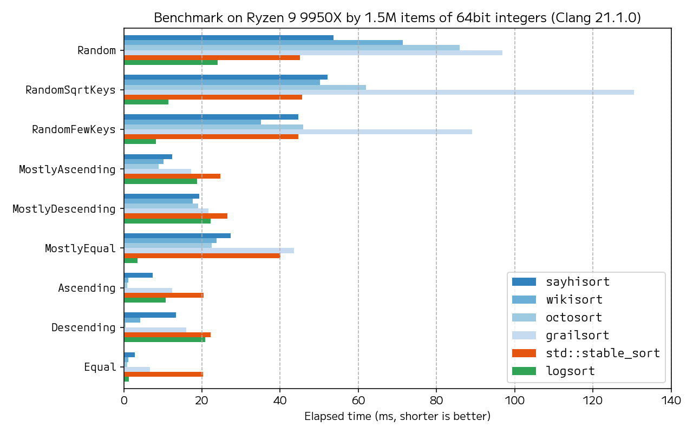

# SayhiSort

**Fast, portable and easy-to-use block merge sort implementation** written in C++17, inspired by [GrailSort](https://github.com/Mrrl/GrailSort). It's in-place, stable and runs in O(N log(N)) worst-case time complexity. The interface is compatible to `std::sort`. When compiled as C++20 or later, it's also compatible to `std::ranges::sort`.

The implementation is **purely swap-based**. It means **no item is constructed** at runtime. Items neither default-constructible nor move-constructible are allowed, as long as they are swappable. Despite the absence of any static buffer, it shows **state-of-the-art performance**.

Substantial effort is made for portability and security. **No floating point number** is used, and the code is carefully written and tested to avoid overflow in any integer-like type. The code has meticulous comments that clarify mathematical invariants.

Its name derives from GrailSort, in honor of its auhor [Andrey Astrelin](https://superliminal.com/andrey/biography.html) rest in peace. Pronunciation of “say hi” sounds like the Japanese word 「聖杯（せいはい）」, which means grail.

## Usage

It's header-only C++ library, so just including `sayhisort.h` is fine. You can also import CMake external project. It provides `sayhisort::sort` function.


```cpp
template <typename Iterator, typename Sentinel, typename Comp = std::less<>>
Iterator sahisort::sort(Iterator first, Sentinel last, Comp comp = {});

```

Interface compatible to `std::ranges::sort` is constrained by concepts. To use the following interface, you need to compile `sayhisort.h` as C++20 or later.


```cpp
template <std::random_access_iterator I, std::sentinel_for<I> S,
          typename Comp = std::ranges::less, typename Proj = std::identity>
    requires std::indirectly_swappable<I> &&
             std::indirect_strict_weak_order<Comp, std::projected<I, Proj>>
constexpr I
sahisort::sort(I first, S last, Comp comp = {}, Proj proj = {});

template <std::ranges::random_access_range R,
         typename Comp = std::ranges::less, typename Proj = std::identity>
    requires std::indirectly_swappable<std::ranges::iterator_t<R>> &&
             std::indirect_strict_weak_order<
                 Comp, std::projected<std::ranges::iterator_t<R>, Proj>>
constexpr std::ranges::borrowed_iterator_t<R>
sahisort::sort(R&& range, Comp comp = {}, Proj proj = {});
```

## Benchmark




Other block merge sort implementations [WikiSort](https://github.com/BonzaiThePenguin/WikiSort/), [octosort](https://github.com/scandum/octosort) and [GrailSort](https://github.com/Mrrl/GrailSort) uses a pre-allocated buffer that stores 512 items. The buffer is claimed to be crucial for performance, however, Sayhisort is very competitive.

You may notice SayhiSort poorly performs on already sorted data compared to WikiSort and octosort. Still SayhiSort can handle those data much faster than random data, so the author believes there's no problem at all.

The performance of [Logsort](https://github.com/aphitorite/Logsort) is noteworthy. It's basically a variant of Quicksort, using novel tagging technique to ensure stability. You need some caution since its worst-case time complexity is O(N^2).

Raw benchmark result is available in [`bench_result`](bench_result/) directory. You can also run the benchmark by yourself as follows.

```sh
mkdir build
pushd build
CC=gcc CXX=g++ cmake -DSAYHISORT_THIRDPARTY_BENCH=ON -GNinja ..
popd
ninja -C build
mkdir build_clang
pushd build_clang
CC=clang CXX=clang++ cmake -DSAYHISORT_THIRDPARTY_BENCH=ON -GNinja ..
popd
ninja -C build_clang
build/test/sayhisort_bench > bench_result/gcc.yml
build_clang/test/sayhisort_bench > bench_result/clang.yml
cd bench_result
./plot.py
```

## Similar projects

### Block merge sort

* https://github.com/BonzaiThePenguin/WikiSort/
* https://github.com/scandum/octosort
* https://github.com/HolyGrailSortProject/Rewritten-Grailsort
* https://github.com/HolyGrailSortProject/Holy-Grailsort
* https://github.com/ecstatic-morse/MrrlSort/

### Other fast in-place and stable sort

* https://github.com/aphitorite/Logsort

  Quicksort with stable partitioning, which is empirically very fast. Its partitioning algorithm, which interprets sequences' arrangement as tag bits, is very elegant. While it has O(N^2) worst-case time complexity and requires a buffer to hold log2(N) items, arguably there's room of improvements.

## Algorithm detail

Sayhisort is a variant of bottom-up block merge sort that

* search (approximately) 2√N unique keys for imitation buffer and data buffer at first, and
* alternately apply left-to-right merge and right-to-left merge to skip needless buffer movement, if data buffer is available.

While all algorithm code is written by the author, many ideas are given from others' research and implementation.

### Searching unique keys

Its overhead heavily depends on input data. If the data has unique keys slightly less that 2√N, it performs worst.

It's hard to eliminate the bottleneck with no pre-allocated buffer, so marginal performance drop is observed. While Sayhisort's performance is still not bad, it isn't the fastest on the `RandomSqrtKey` benchmark.

### Sorting blocks

It takes quite noticeable time.

Each of two sequences to merge, those length is len, are divided at most `sqrt(len) / sqrt(2)` blocks. The blocks are merged in-place by the algorithm based on selection-sort. The merge algorithm is similar to basic one used in merge sort, but it uses selection sort to search the smallest block in the left sequence.

The algorithm is quite basic on block merge sort. Though some micro-optimizations were tried, the result had been inconclusive. Seemingly complex code is harmful due to register pressure. At now there is no idea for further speed-up.

### Merging blocks

It's the most time-consuming routine.

For the case data buffer is available, basically textbook merge algorithm is used. Current implementation applies [cross merge](https://github.com/scandum/quadsort#cross-merge) technique for optimization.

Some adaptive merge logic can significantly improve performance, since the length of two sequences `xs` and `ys` can differ. Depending on data, `ys` can be much longer than `xs`.

When the data buffer isn't available, in-place merge algorithm is required. The algorithm repeats the following procedure to merge sequences `xs` and `ys`:

* find the index `i` such that `xs[i] > ys[0]` by binary searching `xs`
* find the index `j` such in `xs[i] <= ys[j]` by binary searching `ys`, and
* rotate `xs[i:]` and `ys[:j]`.

The computational complexity is still linear, since the algorithm is used only if the number of unique keys is small. In practice, however, in-place merge algorithm can be slow. Sayhisort avoids any pre-allocated buffer, so it resorts to in-place merge in many case. Therefore SayhiSort doesn't 

### Sorting short sequences

It takes small but non-negligible time.

When the sequence length is less than or equals to 8, odd-even sort is used. It's stable and parallelizable by superscalar execution. Specialized odd-even sort functions are dispatched by a heavily optimized loop

The author is reluctant to further optimization, because it likely bloats up inlined code size.

### Sorting unique keys

Its cost is negligible at now, so it isn't worth of micro-optimization.

To de-interleave imitation buffer, bin-sorting is used if the data buffer can be used as a auxiliary space. Otherwise novel O(K logK) algorithm is used, where K is the number of unique keys collected. This algorithm iteratively rotate skewed parts. See [comments](https://github.com/grafi-tt/sayhisort/blob/1a5833f27aaeeb9c463a971ceabd35f51af4c9a9/sayhisort.h#L476-L485) for detail.

The data buffer is sorted by heapsort.

### Rotation sub-algorithm detail

Uses [Helix rotation](https://github.com/scandum/rotate#helix-rotation) for large data, because of it's simple control flow and memory cache memory friendliness. Switches to triple reversal when data becomes small, to avoid integer modulo operation in Helix rotation.

### Binary search sub-algorithm detail

Uses [monobound binary search](https://github.com/scandum/binary_search). In general, the number of comparison to identify an item from N choices is at most ceil(log2(N)). It always performs this fixed number of comparisons. Though there maybe a redundant comparison, branch prediction improvement certainly wins.

### Optimal sequence division technique

Data are divided to sequences as evenly as possible if the input length is non-power-of-2. In principle, the length of each sequence is treated as a rational number. Actual implementation uses bit operations for the sake of efficiency. The author knew this technique from [WikiSort](https://github.com/BonzaiThePenguin/WikiSort/blob/master/Chapter%202.%20Merging.md).
